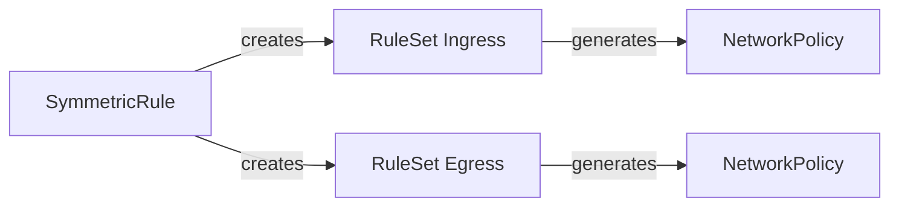

# ZTNP - Zero Trust Network Policy

ZTNP is a Kubernetes controller that simplifies the management of network policies using a zero-trust approach. Instead of manually creating NetworkPolicies for each service, you define high-level **SymmetricRules** that describe allowed traffic flows, and the controller generates the appropriate NetworkPolicies automatically.

## Architecture



## Custom Resources

### SymmetricRule (cluster-scoped)

Defines a bidirectional network flow between two sets of pods:

- **From**: Source pods (namespace + pod selector)
- **To**: Destination pods (namespace + pod selector)
- **Ports**: Allowed ports for the connection

When a SymmetricRule is created, the controller generates:
- **Ingress RuleSets** in "To" namespaces (allowing traffic from "From" pods)
- **Egress RuleSets** in "From" namespaces (allowing traffic to "To" pods)

### RuleSet (namespace-scoped)

An intermediate resource that aggregates rules from multiple SymmetricRules targeting the same pod selector. This avoids NetworkPolicy proliferation by combining rules into a single policy per target.

Each RuleSet generates one **NetworkPolicy** in its namespace.

## How It Works

1. User creates a `SymmetricRule` defining: "App A can talk to App B on port 8080"
2. SymmetricRule controller creates `RuleSets` in relevant namespaces
3. RuleSet controller generates `NetworkPolicies` from the RuleSets
4. Kubernetes enforces the network policies

## Example

```yaml
apiVersion: ztnp.io/v1alpha1
kind: SymmetricRule
metadata:
  name: frontend-to-api
spec:
  from:
    namespaceSelector:
      matchLabels:
        app.kubernetes.io/part-of: frontend
    podSelector:
      matchLabels:
        app: web
  to:
    namespaceSelector:
      matchLabels:
        app.kubernetes.io/part-of: backend
    podSelector:
      matchLabels:
        app: api
  ports:
    - port: 8080
      protocol: TCP
  enforce: true
```

This creates NetworkPolicies allowing the `web` pods in frontend namespaces to communicate with `api` pods in backend namespaces on port 8080.
